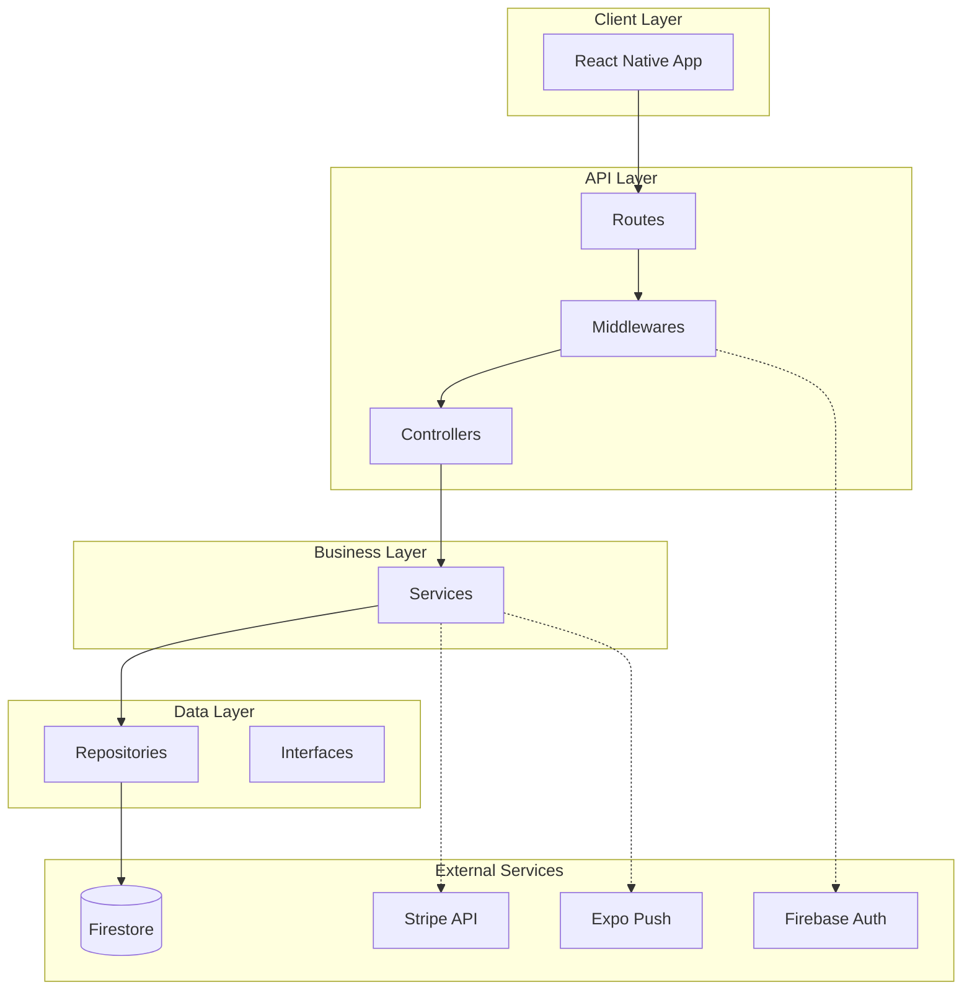
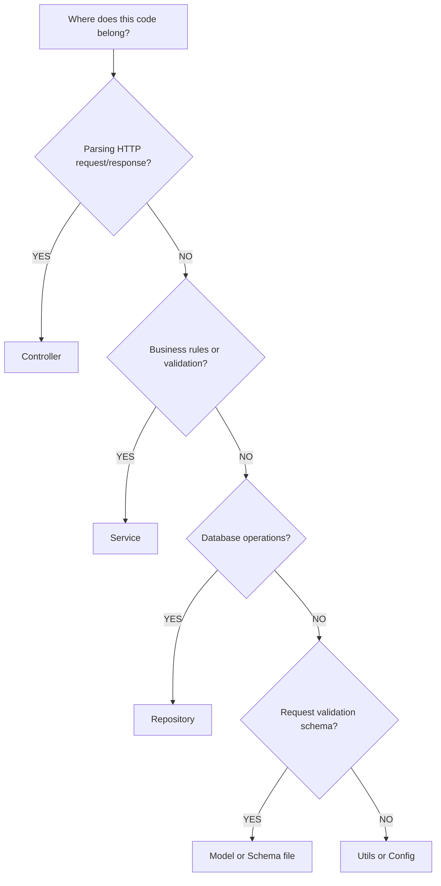
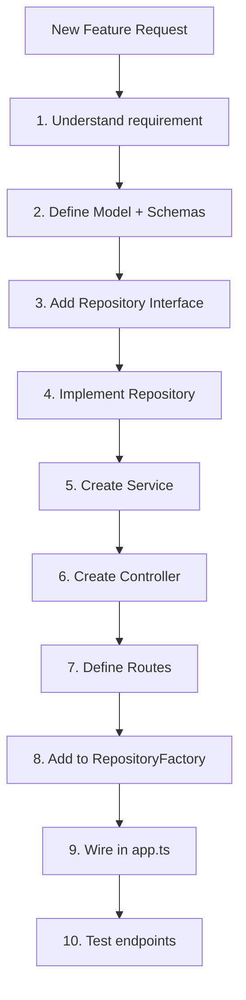

# Carpil API Feature Guide

> Complete reference for AI-assisted development in the Carpil Express API.

---

## Table of Contents

1. [Business Context](#1-business-context)
2. [Code Philosophy](#2-code-philosophy)
3. [Technology Stack](#3-technology-stack)
4. [Architecture](#4-architecture)
5. [Implementation Patterns](#5-implementation-patterns)
6. [Decision Framework](#6-decision-framework)
7. [Code Conventions](#7-code-conventions)
8. [Quality Checklist](#8-quality-checklist)
9. [Key Files Reference](#9-key-files-reference)
10. [Anti-Patterns](#10-anti-patterns)
11. [Debugging Guide](#11-debugging-guide)

---

## 1. Business Context

### Product Identity

| Aspect       | Details                                                          |
| ------------ | ---------------------------------------------------------------- |
| **Product**  | Carpil - Carpooling application                                  |
| **Mission**  | Connect drivers and passengers traveling to the same destination |
| **Market**   | Costa Rica                                                       |
| **Language** | Spanish (error messages and notifications)                       |
| **Currency** | CRC (Costa Rican Colón)                                          |
| **Timezone** | America/Costa_Rica                                               |

### API Mission

The Carpil API is the backbone of the application, responsible for:

- **Data Integrity**: Ensuring consistent state across rides, users, and payments
- **Secure Authentication**: Firebase Auth token validation on all protected endpoints
- **Real-time Updates**: Firestore document updates that trigger mobile app subscriptions
- **Payment Processing**: Stripe integration for secure payment handling
- **Push Notifications**: Expo notifications for ride updates

### Startup Mindset

- **Fast feedback loops**: Ship features quickly, learn from users
- **Purposeful code**: Every line serves data integrity, security, or business needs
- **Simplicity over complexity**: Build for now, not hypothetical futures

### Core API Flows

```
Driver Flow:
POST /rides → POST /rides/:id/start → POST /rides/:id/complete → Payments processed

Passenger Flow:
GET /rides/drivers → POST /rides/:id/join → (ride happens) → POST /payments/confirm

User Flow:
POST /users/signup → GET /users/me/bootstrap → Real-time Firestore sync
```

---

## 2. Code Philosophy

### The Three Principles

Based on [Refactoring Guru Code Smells](https://refactoring.guru/refactoring/smells):

#### Principle 1: Self-Documenting Code

**No comments unless absolutely necessary.** Code should speak for itself.

```typescript
// BAD: Needs comment to explain
const r = await this.ridesRepo.getById(id); // get ride by id

// GOOD: Self-explanatory
const ride = await this.ridesRepo.getById(rideId);
if (!ride) throw new HttpError(404, "Ride not found");
```

Naming conventions:

- Service methods describe actions: `createRide`, `joinRide`, `completeRide`
- Repository methods describe data operations: `getById`, `create`, `update`, `addPassenger`
- Variables reveal intent: `isDriver`, `activeRidesCount`, `departureDate`
- Booleans are questions: `isActive`, `hasPayment`, `canStartRide`

#### Principle 2: Simplicity First

Before writing any code:

1. Understand the problem completely
2. Find multiple solutions
3. Choose the **simplest** one that works
4. If two solutions are equivalent, pick the one with less code

#### Principle 3: Prevent Code Smells

| Category              | What to Avoid                                                   |
| --------------------- | --------------------------------------------------------------- |
| **Bloaters**          | Functions over 30 lines, classes with too many responsibilities |
| **Dispensables**      | Dead code, duplicate code, lazy classes, excessive comments     |
| **Couplers**          | Feature envy, inappropriate intimacy between modules            |
| **Change Preventers** | Shotgun surgery (changes require edits in many places)          |

---

## 3. Technology Stack

### Core Framework

| Technology | Version | Purpose             |
| ---------- | ------- | ------------------- |
| Express.js | 4.21.x  | HTTP server         |
| TypeScript | 5.7.x   | Type safety         |
| Node.js    | 18+     | Runtime environment |

### Data Layer

| Technology     | Purpose                 |
| -------------- | ----------------------- |
| Firebase Admin | Firestore access + Auth |
| Firestore      | NoSQL document database |
| Firebase Auth  | JWT token verification  |

### Validation & Error Handling

| Technology | Purpose                        |
| ---------- | ------------------------------ |
| Zod        | Schema validation              |
| HttpError  | Custom error class with status |

### External Services

| Technology      | Purpose            |
| --------------- | ------------------ |
| Stripe          | Payment processing |
| Expo Server SDK | Push notifications |
| Pino            | Structured logging |

### Development Tools

| Technology  | Purpose               |
| ----------- | --------------------- |
| ts-node-dev | Development server    |
| ts-standard | Linting               |
| tsc-alias   | Path alias resolution |

---

## 4. Architecture

### Directory Structure

```
src/
├── app/                          # Application setup
│   ├── app.ts                    # Express app configuration
│   └── server.ts                 # Server startup
├── config/                       # Configuration
│   ├── env.ts                    # Environment variables (Zod validated)
│   ├── firebase.ts               # Firebase Admin initialization
│   ├── logger.ts                 # Pino logger setup
│   ├── push-notifications.ts     # Expo push notification helpers
│   └── repository.factory.ts     # Repository dependency injection
├── controllers/                  # Request/Response handling
│   ├── rides.controller.ts
│   ├── users.controller.ts
│   ├── chats.controller.ts
│   ├── ratings.controller.ts
│   ├── payments.controller.ts
│   ├── notifications.controller.ts
│   └── webhooks.controller.ts
├── services/                     # Business logic
│   ├── rides.service.ts
│   ├── users.service.ts
│   ├── chats.service.ts
│   ├── ratings.service.ts
│   ├── payments.service.ts
│   └── notifications.service.ts
├── repositories/                 # Data access
│   └── firebase/                 # Firestore implementations
│       ├── rides.repository.ts
│       ├── users.repository.ts
│       ├── chats.repository.ts
│       ├── ratings.repository.ts
│       ├── payments.repository.ts
│       └── notifications.repository.ts
├── routes/                       # Route definitions
│   ├── index.ts                  # Route aggregator
│   └── v1/                       # API version 1
│       ├── rides.routes.ts
│       ├── users.routes.ts
│       ├── chats.routes.ts
│       ├── ratings.routes.ts
│       ├── payments.routes.ts
│       └── notifications.routes.ts
├── middlewares/                  # Express middlewares
│   ├── auth.middleware.ts        # Firebase token verification
│   ├── validation.middleware.ts  # Zod body validation
│   ├── error.middleware.ts       # Global error handler
│   └── logging.middleware.ts     # Request logging
├── models/                       # Zod schemas and types
│   ├── ride.model.ts             # Ride schema + types
│   ├── user.ts                   # User types
│   ├── chat.model.ts             # Chat schema + types
│   ├── rating.model.ts           # Rating schema + types
│   └── payment.model.ts          # Payment schema + types
├── schemas/                      # Request validation schemas
│   ├── ride.ts
│   ├── user.ts
│   ├── rating.ts
│   ├── message.ts
│   └── payment.ts
├── interfaces/                   # TypeScript interfaces
│   └── repositories.interface.ts # Repository contracts
├── types/                        # Additional types
│   └── stripe.types.ts
├── utils/                        # Utilities
│   ├── http.ts                   # HttpError + asyncHandler
│   ├── constants.ts              # App constants
│   ├── crypto.ts                 # Encryption utilities
│   └── ride-utils.ts             # Ride helper functions
├── index.ts                      # Exports
└── main.ts                       # Entry point
```

### Layered Architecture



### Request Flow

Every API request follows this path:

```
HTTP Request
    ↓
Express Router (routes/v1/*.routes.ts)
    ↓
Middlewares (authenticate, validateBody)
    ↓
Controller (handle request/response)
    ↓
Service (business logic)
    ↓
Repository (data access)
    ↓
Firestore (database)
    ↓
Response (JSON)
```

### Dependency Injection Pattern

The application uses manual constructor injection:

```typescript
// In app.ts - Initialize dependencies
const usersRepo = RepositoryFactory.createUsersRepository();
const ridesRepo = RepositoryFactory.createRidesRepository();
const ridesService = new RidesService(
  ridesRepo,
  usersRepo,
  chatsRepo,
  paymentsRepo
);
const ridesController = new RidesController(ridesService);
```

---

## 5. Implementation Patterns

> **Note**: All patterns below are derived from actual implementations in the codebase.
> Reference the real files for the most up-to-date patterns.

### Real Implementation References

| Pattern               | Reference File                              | Key Elements                     |
| --------------------- | ------------------------------------------- | -------------------------------- |
| Route Definition      | `routes/v1/rides.routes.ts`                 | Router factory, middleware chain |
| Controller            | `controllers/rides.controller.ts`           | asyncHandler, AuthRequest        |
| Service               | `services/rides.service.ts`                 | Business logic, HttpError        |
| Repository            | `repositories/firebase/rides.repository.ts` | Firestore CRUD                   |
| Model + Schema        | `models/ride.model.ts`                      | Zod schemas, TypeScript types    |
| Auth Middleware       | `middlewares/auth.middleware.ts`            | Token verification               |
| Validation Middleware | `middlewares/validation.middleware.ts`      | Zod body parsing                 |

---

### Pattern A: Route Definition

Location: `src/routes/v1/`

```typescript
import { Router } from "express";
import { authenticate } from "../../middlewares/auth.middleware";
import { validateBody } from "../../middlewares/validation.middleware";
import { EntityController } from "../../controllers/entity.controller";
import { CreateEntitySchema } from "../../models/entity.model";

const createEntityRouter = (entityController: EntityController) => {
  const router = Router();

  // Public endpoint (no auth)
  router.get("/", (req, res, next) => entityController.list(req, res, next));

  // Authenticated endpoint
  router.get("/:id", authenticate, (req, res, next) =>
    entityController.getById(req, res, next)
  );

  // Authenticated + validated endpoint
  router.post(
    "/",
    authenticate,
    validateBody(CreateEntitySchema),
    (req, res, next) => entityController.create(req, res, next)
  );

  // Update endpoint
  router.patch(
    "/:id",
    authenticate,
    validateBody(UpdateEntitySchema),
    (req, res, next) => entityController.update(req, res, next)
  );

  // Delete endpoint
  router.delete("/:id", authenticate, (req, res, next) =>
    entityController.delete(req, res, next)
  );

  return router;
};

export default createEntityRouter;
```

Key elements:

- Factory function receives controller instance
- Use `authenticate` middleware for protected routes
- Use `validateBody(Schema)` for request body validation
- Always pass `(req, res, next)` to controller methods

---

### Pattern B: Controller

Location: `src/controllers/`

```typescript
import { Response } from "express";
import { EntityService } from "../services/entity.service";
import { asyncHandler } from "../utils/http";
import { CreateEntitySchema } from "../models/entity.model";
import { AuthRequest } from "../middlewares/auth.middleware";

export class EntityController {
  constructor(private readonly entityService: EntityService) {}

  list = asyncHandler(async (_req: AuthRequest, res: Response) => {
    const entities = await this.entityService.listAll();
    res.json({ entities });
  });

  getById = asyncHandler(async (req: AuthRequest, res: Response) => {
    const entity = await this.entityService.getById(req.params.id);
    res.json({ entity });
  });

  create = asyncHandler(async (req: AuthRequest, res: Response) => {
    const input = CreateEntitySchema.parse(req.body);
    const userId = req.user?.uid ?? "";
    const entity = await this.entityService.create(userId, input);
    res.status(201).json({ entity });
  });

  update = asyncHandler(async (req: AuthRequest, res: Response) => {
    await this.entityService.update(
      req.params.id,
      req.user?.uid ?? "",
      req.body
    );
    res.json({ message: "Entity updated successfully" });
  });

  delete = asyncHandler(async (req: AuthRequest, res: Response) => {
    await this.entityService.delete(req.params.id, req.user?.uid ?? "");
    res.json({ message: "Entity deleted successfully" });
  });
}
```

Key elements:

- Use `asyncHandler` wrapper for all methods (catches errors automatically)
- Use `AuthRequest` type to access `req.user`
- Get user ID from `req.user?.uid`
- Return 201 for creates, 200 for updates/deletes
- Consistent response format: `{ entity }` or `{ entities }` or `{ message }`

---

### Pattern C: Service

Location: `src/services/`

```typescript
import { EntityRepository } from "../repositories/firebase/entity.repository";
import { UsersRepository } from "../repositories/firebase/users.repository";
import { CreateEntityInput, Entity } from "../models/entity.model";
import { HttpError } from "../utils/http";
import { sendPushNotifications } from "config/push-notifications";

export class EntityService {
  constructor(
    private readonly entityRepo: EntityRepository,
    private readonly usersRepo: UsersRepository
  ) {}

  async listAll(): Promise<Entity[]> {
    return this.entityRepo.listAll();
  }

  async getById(id: string): Promise<Entity> {
    const entity = await this.entityRepo.getById(id);
    if (!entity) throw new HttpError(404, "Entity not found");
    return entity;
  }

  async create(userId: string, data: CreateEntityInput): Promise<Entity> {
    // Validate user exists
    if (!userId) throw new HttpError(401, "Unauthorized");

    const user = await this.usersRepo.getById(userId);
    if (!user) throw new HttpError(404, "User not found");

    // Business validation
    const existingCount = await this.entityRepo.countByUser(userId);
    if (existingCount >= 5) {
      throw new HttpError(400, "Maximum entities limit reached");
    }

    // Create entity
    const newEntity: Omit<Entity, "id"> = {
      ...data,
      ownerId: userId,
      createdAt: new Date(),
      updatedAt: new Date(),
    };

    return this.entityRepo.create(newEntity);
  }

  async update(
    id: string,
    userId: string,
    updates: Partial<Entity>
  ): Promise<void> {
    const entity = await this.getById(id);

    // Authorization check
    if (entity.ownerId !== userId) {
      throw new HttpError(403, "You are not authorized to update this entity");
    }

    await this.entityRepo.update(id, { ...updates, updatedAt: new Date() });
  }

  async delete(id: string, userId: string): Promise<void> {
    const entity = await this.getById(id);

    // Authorization check
    if (entity.ownerId !== userId) {
      throw new HttpError(403, "You are not authorized to delete this entity");
    }

    await this.entityRepo.delete(id);
  }
}
```

Key elements:

- Receive repositories via constructor injection
- All business logic lives here
- Use `HttpError` with appropriate status codes:
  - 400: Bad request (validation, business rules)
  - 401: Unauthorized (no user)
  - 403: Forbidden (user can't access resource)
  - 404: Not found
  - 429: Rate limit exceeded
- Authorization checks in service, not controller
- Always set `updatedAt: new Date()` on updates

---

### Pattern D: Repository

Location: `src/repositories/firebase/`

```typescript
import { firestore } from "config/firebase";
import { FieldValue } from "firebase-admin/firestore";
import { Entity } from "@models/entity.model";
import { IEntityRepository } from "@interfaces/repositories.interface";

export class EntityRepository implements IEntityRepository {
  private readonly collection = "entities";

  async getById(id: string): Promise<Entity | null> {
    const doc = await firestore.collection(this.collection).doc(id).get();
    if (!doc.exists) return null;

    const data = doc.data() as any;
    return {
      ...data,
      id: doc.id,
      // Convert Firestore Timestamps to Date
      createdAt: data?.createdAt?.toDate() ?? null,
      updatedAt: data?.updatedAt?.toDate() ?? null,
      deletedAt: data?.deletedAt?.toDate() ?? null,
    } as Entity;
  }

  async listAll(): Promise<Entity[]> {
    const snapshot = await firestore.collection(this.collection).get();
    return snapshot.docs.map((doc) => {
      const data = doc.data() as any;
      return {
        ...data,
        id: doc.id,
        createdAt: data?.createdAt?.toDate() ?? null,
        updatedAt: data?.updatedAt?.toDate() ?? null,
      } as Entity;
    });
  }

  async countByUser(userId: string): Promise<number> {
    const query = await firestore
      .collection(this.collection)
      .where("ownerId", "==", userId)
      .where("deletedAt", "==", null)
      .get();
    return query.size;
  }

  async create(entity: Omit<Entity, "id">): Promise<Entity> {
    const docRef = firestore.collection(this.collection).doc();
    const entityWithId = { ...entity, id: docRef.id };
    await docRef.set(entityWithId);
    return entityWithId as Entity;
  }

  async update(id: string, updates: Partial<Entity>): Promise<void> {
    await firestore.collection(this.collection).doc(id).update(updates);
  }

  async delete(id: string): Promise<void> {
    // Soft delete
    await firestore.collection(this.collection).doc(id).update({
      deletedAt: new Date(),
      updatedAt: new Date(),
    });
  }

  async addToArray(id: string, field: string, value: any): Promise<void> {
    await firestore
      .collection(this.collection)
      .doc(id)
      .update({
        [field]: FieldValue.arrayUnion(value),
        updatedAt: new Date(),
      });
  }
}
```

Key elements:

- Implement interface from `interfaces/repositories.interface.ts`
- Always convert Firestore Timestamps to JavaScript Dates
- Use `doc.id` for the entity ID
- Use `FieldValue.arrayUnion` for adding to arrays
- Prefer soft deletes (`deletedAt`) over hard deletes
- No business logic here - pure data access

---

### Pattern E: Model with Zod Schema

Location: `src/models/`

```typescript
import { z } from "zod";

// Enums
export enum EntityStatus {
  Active = "active",
  Inactive = "inactive",
  Deleted = "deleted",
}

// Nested schemas
export const EntityMetadataSchema = z.object({
  key: z.string(),
  value: z.string(),
});
export type EntityMetadata = z.infer<typeof EntityMetadataSchema>;

// Main entity schema
export const EntitySchema = z.object({
  id: z.string(),
  name: z.string().min(1),
  description: z.string().optional(),
  ownerId: z.string(),
  status: z.nativeEnum(EntityStatus),
  metadata: z.array(EntityMetadataSchema).optional().default([]),
  createdAt: z.date(),
  updatedAt: z.date(),
  deletedAt: z.date().nullable().optional(),
});
export type Entity = z.infer<typeof EntitySchema>;

// Create input schema (subset of Entity)
export const CreateEntitySchema = z.object({
  name: z.string().min(1, "Name is required"),
  description: z.string().optional(),
  metadata: z.array(EntityMetadataSchema).optional(),
});
export type CreateEntityInput = z.infer<typeof CreateEntitySchema>;

// Update input schema
export const UpdateEntitySchema = z.object({
  name: z.string().min(1).optional(),
  description: z.string().optional(),
  status: z.nativeEnum(EntityStatus).optional(),
});
export type UpdateEntityInput = z.infer<typeof UpdateEntitySchema>;
```

Key elements:

- Use `z.infer<typeof Schema>` to derive TypeScript types
- Create separate schemas for Create and Update inputs
- Use `z.nativeEnum()` for TypeScript enums
- Use `z.coerce.date()` for date strings that need parsing
- Add validation messages for user-facing errors

---

### Pattern F: Repository Interface

Location: `src/interfaces/repositories.interface.ts`

```typescript
import { Entity } from "../models/entity.model";

export interface IEntityRepository {
  getById(id: string): Promise<Entity | null>;
  listAll(): Promise<Entity[]>;
  countByUser(userId: string): Promise<number>;
  create(entity: Omit<Entity, "id">): Promise<Entity>;
  update(id: string, partial: Partial<Entity>): Promise<void>;
  delete(id: string): Promise<void>;
}
```

Key elements:

- Define contracts for repository methods
- Return `Promise<Entity | null>` for single lookups
- Return `Promise<Entity[]>` for lists
- Use `Omit<Entity, 'id'>` for create input

---

### Pattern G: Wiring It All Together

Location: `src/app/app.ts`

```typescript
// 1. Create repositories
const entityRepo = RepositoryFactory.createEntityRepository();

// 2. Create services (inject repositories)
const entityService = new EntityService(entityRepo, usersRepo);

// 3. Create controllers (inject services)
const entityController = new EntityController(entityService);

// 4. Create routes (pass controller)
const routes = createRoutes({
  entityController,
  // ... other controllers
});

// 5. Mount routes
app.use("/", routes);
```

Location: `src/routes/index.ts`

```typescript
import createEntityRouter from "./v1/entity.routes";

export interface Controllers {
  entityController: EntityController;
  // ... other controllers
}

const createRoutes = (controllers: Controllers) => {
  const router = Router();
  router.use("/v1/entities", createEntityRouter(controllers.entityController));
  return router;
};

export default createRoutes;
```

---

### Pattern H: Push Notifications

Location: In service layer, using `config/push-notifications.ts`

```typescript
import { sendPushNotifications } from 'config/push-notifications'

// In a service method
async notifyUser(userId: string, title: string, body: string, data: object): Promise<void> {
  const user = await this.usersRepo.getById(userId)
  if (!user?.pushToken?.length) return

  await sendPushNotifications({
    pushTokens: user.pushToken,
    title,
    body,
    data
  })
}
```

---

## 6. Decision Framework

### Layer Responsibility Decision



**Text version:**

```
Where does this code belong?

Is it parsing HTTP request/response?
└── YES → Controller

Is it business rules, authorization, or validation?
└── YES → Service

Is it database operations (Firestore)?
└── YES → Repository

Is it request/response schema definition?
└── YES → Model file (*.model.ts)

Is it reusable utility?
└── YES → Utils folder
```

### Error Status Code Decision

| Condition                       | Status | Example                                    |
| ------------------------------- | ------ | ------------------------------------------ |
| No token or invalid token       | 401    | `throw new HttpError(401, 'Unauthorized')` |
| User can't access this resource | 403    | `throw new HttpError(403, 'Forbidden')`    |
| Resource doesn't exist          | 404    | `throw new HttpError(404, 'Not found')`    |
| Invalid request data            | 400    | `throw new HttpError(400, 'Invalid data')` |
| Business rule violation         | 400    | `throw new HttpError(400, 'No seats')`     |
| Rate limit exceeded             | 429    | `throw new HttpError(429, 'Too many')`     |
| Zod validation failure          | 400    | Handled by error middleware                |

### Middleware Decision

```
Which middleware to apply?

Is it a public endpoint (no user needed)?
└── NO → Add authenticate

Does it accept a request body?
└── YES → Add validateBody(Schema)

Does it need special parsing (webhooks)?
└── YES → Add express.raw() BEFORE express.json()
```

### New Feature Decision Flow



---

## 7. Code Conventions

### Import Aliases

Configured in `tsconfig.json`:

```typescript
// Models
import { Entity } from "@models/entity.model";

// Middlewares
import { authenticate } from "@middlewares/auth.middleware";

// Utils
import { HttpError, asyncHandler } from "@utils/http";

// Controllers
import { EntityController } from "@controllers/entity.controller";

// Services
import { EntityService } from "@services/entity.service";

// Repositories
import { EntityRepository } from "@repositories/firebase/entity.repository";

// Interfaces
import { IEntityRepository } from "@interfaces/repositories.interface";

// Config
import { firestore } from "config/firebase";
import { logger } from "config/logger";
import { env } from "config/env";
```

### Naming Conventions

| Type            | Convention               | Example                               |
| --------------- | ------------------------ | ------------------------------------- |
| Files (routes)  | kebab-case.routes.ts     | `rides.routes.ts`                     |
| Files (other)   | kebab-case.ts            | `ride.model.ts`, `auth.middleware.ts` |
| Classes         | PascalCase               | `RidesService`, `RidesController`     |
| Interfaces      | IPascalCase              | `IRidesRepository`                    |
| Methods         | camelCase                | `createRide`, `getById`               |
| Route factories | createXxxRouter          | `createRidesRouter`                   |
| Enums           | PascalCase               | `RideStatus`                          |
| Enum values     | PascalCase               | `RideStatus.Active`                   |
| Schemas         | PascalCaseSchema         | `CreateRideSchema`                    |
| Types           | PascalCase (from schema) | `CreateRideInput`                     |

### Response Format

Always use consistent JSON structure:

```typescript
// Single entity
res.json({ entity })
res.json({ ride })
res.json({ user })

// Multiple entities
res.json({ entities })
res.json({ rides })
res.json({ users })

// Success message
res.json({ message: 'Operation completed successfully' })

// Created resource
res.status(201).json({ entity })

// Error (handled by middleware)
{ message: 'Error description' }

// Validation error
{ message: 'Validation error', errors: { ... } }
```

### HTTP Status Codes

| Code | When to Use                        |
| ---- | ---------------------------------- |
| 200  | Successful GET, PUT, PATCH, DELETE |
| 201  | Successful POST (resource created) |
| 400  | Bad request, validation error      |
| 401  | No token or invalid token          |
| 403  | User lacks permission              |
| 404  | Resource not found                 |
| 429  | Rate limit exceeded                |
| 500  | Internal server error (unhandled)  |

### File Organization Within Each Layer

```
controllers/
├── rides.controller.ts      # One controller per resource
├── users.controller.ts
└── chats.controller.ts

services/
├── rides.service.ts         # One service per resource
├── users.service.ts
└── chats.service.ts

repositories/firebase/
├── rides.repository.ts      # One repository per collection
├── users.repository.ts
└── chats.repository.ts
```

---

## 8. Quality Checklist

Before completing ANY endpoint or feature, verify:

### Type Safety

- [ ] All parameters and return types are defined
- [ ] No `any` types (except Firestore raw data casting)
- [ ] Zod schemas defined for request bodies
- [ ] Types exported from model files

### Layer Separation

- [ ] Controller only handles req/res
- [ ] Business logic in service layer
- [ ] Data access in repository layer
- [ ] No Firestore imports in services

### Security

- [ ] Protected endpoints use `authenticate` middleware
- [ ] Authorization checks in service layer
- [ ] User ID from `req.user?.uid`, not request body
- [ ] No sensitive data in responses

### Error Handling

- [ ] All service methods throw `HttpError` appropriately
- [ ] Controllers wrapped with `asyncHandler`
- [ ] 404 thrown when resource not found
- [ ] 403 thrown for authorization failures

### Data Integrity

- [ ] `createdAt` set on create
- [ ] `updatedAt` set on create and update
- [ ] Timestamps converted from Firestore
- [ ] Soft deletes use `deletedAt`

### Response Format

- [ ] Consistent response structure
- [ ] Correct HTTP status codes
- [ ] 201 for creates, 200 for others

### Code Quality

- [ ] Follows existing patterns exactly
- [ ] No duplicate code
- [ ] Functions under 30 lines
- [ ] Self-documenting names

---

## 9. Key Files Reference

### Configuration Files

| File                               | Purpose                             |
| ---------------------------------- | ----------------------------------- |
| `src/config/env.ts`                | Zod-validated environment variables |
| `src/config/firebase.ts`           | Firebase Admin initialization       |
| `src/config/logger.ts`             | Pino logger instance                |
| `src/config/push-notifications.ts` | Expo push notification helpers      |
| `src/config/repository.factory.ts` | Repository dependency injection     |

### Core Utilities

| File                     | Purpose               | Key Exports                 |
| ------------------------ | --------------------- | --------------------------- |
| `src/utils/http.ts`      | HTTP helpers          | `HttpError`, `asyncHandler` |
| `src/utils/constants.ts` | Application constants | Various constants           |

### Middleware

| File                                       | Purpose                   |
| ------------------------------------------ | ------------------------- |
| `src/middlewares/auth.middleware.ts`       | Firebase token validation |
| `src/middlewares/validation.middleware.ts` | Zod body validation       |
| `src/middlewares/error.middleware.ts`      | Global error handler      |
| `src/middlewares/logging.middleware.ts`    | Request logging           |

### Application Setup

| File                  | Purpose                 |
| --------------------- | ----------------------- |
| `src/main.ts`         | Application entry point |
| `src/app/app.ts`      | Express app + DI setup  |
| `src/routes/index.ts` | Route aggregator        |

### Type Definitions

| File                                       | Purpose                  |
| ------------------------------------------ | ------------------------ |
| `src/interfaces/repositories.interface.ts` | Repository contracts     |
| `src/models/ride.model.ts`                 | Ride schemas and types   |
| `src/models/user.ts`                       | User types               |
| `src/models/chat.model.ts`                 | Chat schemas and types   |
| `src/models/rating.model.ts`               | Rating schemas and types |

---

## 10. Anti-Patterns

### Never Do These

| Anti-Pattern                   | Why                          | Do Instead                            |
| ------------------------------ | ---------------------------- | ------------------------------------- |
| Business logic in controller   | Hard to test, violates SRP   | Put in service layer                  |
| Direct Firestore in service    | Breaks layer separation      | Use repository                        |
| Skip `asyncHandler`            | Unhandled promise rejections | Always wrap controller methods        |
| Trust client-sent user ID      | Security vulnerability       | Use `req.user?.uid` from token        |
| Return raw Firestore data      | Timestamps are wrong type    | Convert in repository                 |
| Hardcode status codes          | Inconsistent responses       | Use `HttpError` with appropriate code |
| Skip validation                | Invalid data in database     | Use `validateBody(Schema)`            |
| Catch and swallow errors       | Silent failures              | Let errors bubble to middleware       |
| Add fields without `updatedAt` | Data integrity issues        | Always update `updatedAt`             |
| Inline Zod schemas             | Not reusable                 | Define in model files                 |

### Code Smell Examples

```typescript
// BAD: Business logic in controller
create = asyncHandler(async (req: AuthRequest, res: Response) => {
  const user = await this.usersRepo.getById(req.user?.uid ?? "");
  if (!user) throw new HttpError(404, "User not found");
  if (user.ridesCount >= 5) throw new HttpError(400, "Limit reached");
  // ... more logic
  res.status(201).json({ entity });
});

// GOOD: Controller delegates to service
create = asyncHandler(async (req: AuthRequest, res: Response) => {
  const entity = await this.entityService.create(req.user?.uid ?? "", req.body);
  res.status(201).json({ entity });
});
```

```typescript
// BAD: Direct Firestore access in service
async create(data: CreateInput): Promise<Entity> {
  const docRef = firestore.collection('entities').doc()
  await docRef.set(data)
  return { id: docRef.id, ...data }
}

// GOOD: Use repository
async create(data: CreateInput): Promise<Entity> {
  return this.entityRepo.create(data)
}
```

```typescript
// BAD: Trust client user ID
router.post("/", authenticate, (req, res, next) => {
  const userId = req.body.userId; // SECURITY RISK!
  // ...
});

// GOOD: Use authenticated user
router.post("/", authenticate, (req, res, next) => {
  const userId = req.user?.uid ?? "";
  // ...
});
```

```typescript
// BAD: Return raw Firestore data
async getById(id: string): Promise<Entity | null> {
  const doc = await firestore.collection('entities').doc(id).get()
  return doc.data() as Entity  // Timestamps are Firestore objects!
}

// GOOD: Convert timestamps
async getById(id: string): Promise<Entity | null> {
  const doc = await firestore.collection('entities').doc(id).get()
  if (!doc.exists) return null
  const data = doc.data() as any
  return {
    ...data,
    id: doc.id,
    createdAt: data?.createdAt?.toDate() ?? null,
    updatedAt: data?.updatedAt?.toDate() ?? null
  } as Entity
}
```

---

## 11. Debugging Guide

### Common Issues

| Symptom                           | Likely Cause                       | Solution                               |
| --------------------------------- | ---------------------------------- | -------------------------------------- |
| 401 Unauthorized                  | Missing/invalid Firebase token     | Check `Authorization: Bearer <token>`  |
| Dates show as objects             | Firestore timestamps not converted | Convert with `.toDate()` in repository |
| Validation error on valid data    | Schema mismatch                    | Check Zod schema matches request       |
| 500 Internal Server Error         | Unhandled exception                | Check logs, add proper error handling  |
| Firebase permission denied        | Firestore rules                    | Check Firebase console rules           |
| Cannot read property of undefined | Missing null checks                | Add `?.` optional chaining             |
| Route not found                   | Route not registered               | Check `routes/index.ts` and `app.ts`   |

### Debugging Checklist

1. **Check the logs**: Look for errors in console output
2. **Verify token**: Is the Authorization header correct?
3. **Check request body**: Does it match the Zod schema?
4. **Verify route exists**: Is it registered in `routes/index.ts`?
5. **Check Firestore**: Is the document there? Correct collection?
6. **Check types**: Are all imports correct?

### Development Commands

```bash
# Start development server with hot reload
pnpm dev

# Build TypeScript
pnpm build

# Run production build
pnpm start

# Lint code
pnpm lint
```

### Testing Endpoints

Use curl or a tool like Postman/Insomnia:

```bash
# Get endpoint (no auth)
curl http://localhost:8080/v1/rides/drivers

# Get endpoint (with auth)
curl http://localhost:8080/v1/rides/drivers/RIDE_ID \
  -H "Authorization: Bearer YOUR_FIREBASE_TOKEN"

# Post endpoint (with auth + body)
curl -X POST http://localhost:8080/v1/rides \
  -H "Authorization: Bearer YOUR_FIREBASE_TOKEN" \
  -H "Content-Type: application/json" \
  -d '{"origin": {...}, "destination": {...}, "availableSeats": 3, "price": 5000, "departureDate": "2025-01-15T10:00:00Z"}'
```

### Environment Variables

Required in `.env` or `.env.local`:

```env
NODE_ENV=development
PORT=8080
STRIPE_SECRET_KEY=sk_test_...
STRIPE_WEBHOOK_SECRET=whsec_...
FIREBASE_SERVICE_ACCOUNT_PATH=./src/config/firebase-service-account.json
# OR individual Firebase credentials
FIREBASE_PROJECT_ID=...
FIREBASE_CLIENT_EMAIL=...
FIREBASE_PRIVATE_KEY=...
```

---

## Appendix A: Complete CRUD Example

This section shows a complete example of creating a new "bookings" feature.

### Step 1: Define Model

`src/models/booking.model.ts`

```typescript
import { z } from "zod";

export enum BookingStatus {
  Pending = "pending",
  Confirmed = "confirmed",
  Cancelled = "cancelled",
}

export const BookingSchema = z.object({
  id: z.string(),
  rideId: z.string(),
  passengerId: z.string(),
  seats: z.number().int().min(1).max(4),
  status: z.nativeEnum(BookingStatus),
  createdAt: z.date(),
  updatedAt: z.date(),
});
export type Booking = z.infer<typeof BookingSchema>;

export const CreateBookingSchema = z.object({
  rideId: z.string().min(1, "Ride ID is required"),
  seats: z
    .number()
    .int()
    .min(1, "At least 1 seat required")
    .max(4, "Maximum 4 seats"),
});
export type CreateBookingInput = z.infer<typeof CreateBookingSchema>;
```

### Step 2: Add Repository Interface

`src/interfaces/repositories.interface.ts`

```typescript
// Add to existing file
export interface IBookingsRepository {
  getById(id: string): Promise<Booking | null>;
  listByPassenger(passengerId: string): Promise<Booking[]>;
  listByRide(rideId: string): Promise<Booking[]>;
  create(booking: Omit<Booking, "id">): Promise<Booking>;
  update(id: string, partial: Partial<Booking>): Promise<void>;
}
```

### Step 3: Implement Repository

`src/repositories/firebase/bookings.repository.ts`

```typescript
import { firestore } from "config/firebase";
import { Booking, BookingStatus } from "@models/booking.model";
import { IBookingsRepository } from "@interfaces/repositories.interface";

export class BookingsRepository implements IBookingsRepository {
  async getById(id: string): Promise<Booking | null> {
    const doc = await firestore.collection("bookings").doc(id).get();
    if (!doc.exists) return null;
    const data = doc.data() as any;
    return {
      ...data,
      id: doc.id,
      createdAt: data?.createdAt?.toDate() ?? null,
      updatedAt: data?.updatedAt?.toDate() ?? null,
    } as Booking;
  }

  async listByPassenger(passengerId: string): Promise<Booking[]> {
    const snapshot = await firestore
      .collection("bookings")
      .where("passengerId", "==", passengerId)
      .get();
    return snapshot.docs.map((doc) => {
      const data = doc.data() as any;
      return {
        ...data,
        id: doc.id,
        createdAt: data?.createdAt?.toDate() ?? null,
        updatedAt: data?.updatedAt?.toDate() ?? null,
      } as Booking;
    });
  }

  async listByRide(rideId: string): Promise<Booking[]> {
    const snapshot = await firestore
      .collection("bookings")
      .where("rideId", "==", rideId)
      .get();
    return snapshot.docs.map((doc) => {
      const data = doc.data() as any;
      return {
        ...data,
        id: doc.id,
        createdAt: data?.createdAt?.toDate() ?? null,
        updatedAt: data?.updatedAt?.toDate() ?? null,
      } as Booking;
    });
  }

  async create(booking: Omit<Booking, "id">): Promise<Booking> {
    const docRef = firestore.collection("bookings").doc();
    const bookingWithId = { ...booking, id: docRef.id };
    await docRef.set(bookingWithId);
    return bookingWithId as Booking;
  }

  async update(id: string, updates: Partial<Booking>): Promise<void> {
    await firestore.collection("bookings").doc(id).update(updates);
  }
}
```

### Step 4: Create Service

`src/services/bookings.service.ts`

```typescript
import { BookingsRepository } from "../repositories/firebase/bookings.repository";
import { RidesRepository } from "../repositories/firebase/rides.repository";
import {
  CreateBookingInput,
  Booking,
  BookingStatus,
} from "../models/booking.model";
import { HttpError } from "../utils/http";

export class BookingsService {
  constructor(
    private readonly bookingsRepo: BookingsRepository,
    private readonly ridesRepo: RidesRepository
  ) {}

  async getById(id: string): Promise<Booking> {
    const booking = await this.bookingsRepo.getById(id);
    if (!booking) throw new HttpError(404, "Booking not found");
    return booking;
  }

  async listMyBookings(passengerId: string): Promise<Booking[]> {
    return this.bookingsRepo.listByPassenger(passengerId);
  }

  async create(
    passengerId: string,
    data: CreateBookingInput
  ): Promise<Booking> {
    if (!passengerId) throw new HttpError(401, "Unauthorized");

    const ride = await this.ridesRepo.getById(data.rideId);
    if (!ride) throw new HttpError(404, "Ride not found");
    if (ride.availableSeats < data.seats) {
      throw new HttpError(400, "Not enough available seats");
    }

    const newBooking: Omit<Booking, "id"> = {
      rideId: data.rideId,
      passengerId,
      seats: data.seats,
      status: BookingStatus.Pending,
      createdAt: new Date(),
      updatedAt: new Date(),
    };

    return this.bookingsRepo.create(newBooking);
  }

  async cancel(id: string, passengerId: string): Promise<void> {
    const booking = await this.getById(id);
    if (booking.passengerId !== passengerId) {
      throw new HttpError(403, "You cannot cancel this booking");
    }
    if (booking.status === BookingStatus.Cancelled) {
      throw new HttpError(400, "Booking is already cancelled");
    }

    await this.bookingsRepo.update(id, {
      status: BookingStatus.Cancelled,
      updatedAt: new Date(),
    });
  }
}
```

### Step 5: Create Controller

`src/controllers/bookings.controller.ts`

```typescript
import { Response } from "express";
import { BookingsService } from "../services/bookings.service";
import { asyncHandler } from "../utils/http";
import { CreateBookingSchema } from "../models/booking.model";
import { AuthRequest } from "../middlewares/auth.middleware";

export class BookingsController {
  constructor(private readonly bookingsService: BookingsService) {}

  getById = asyncHandler(async (req: AuthRequest, res: Response) => {
    const booking = await this.bookingsService.getById(req.params.id);
    res.json({ booking });
  });

  listMyBookings = asyncHandler(async (req: AuthRequest, res: Response) => {
    const bookings = await this.bookingsService.listMyBookings(
      req.user?.uid ?? ""
    );
    res.json({ bookings });
  });

  create = asyncHandler(async (req: AuthRequest, res: Response) => {
    const input = CreateBookingSchema.parse(req.body);
    const booking = await this.bookingsService.create(
      req.user?.uid ?? "",
      input
    );
    res.status(201).json({ booking });
  });

  cancel = asyncHandler(async (req: AuthRequest, res: Response) => {
    await this.bookingsService.cancel(req.params.id, req.user?.uid ?? "");
    res.json({ message: "Booking cancelled successfully" });
  });
}
```

### Step 6: Define Routes

`src/routes/v1/bookings.routes.ts`

```typescript
import { Router } from "express";
import { authenticate } from "../../middlewares/auth.middleware";
import { validateBody } from "../../middlewares/validation.middleware";
import { BookingsController } from "../../controllers/bookings.controller";
import { CreateBookingSchema } from "../../models/booking.model";

const createBookingsRouter = (bookingsController: BookingsController) => {
  const router = Router();

  router.get("/me", authenticate, (req, res, next) =>
    bookingsController.listMyBookings(req, res, next)
  );
  router.get("/:id", authenticate, (req, res, next) =>
    bookingsController.getById(req, res, next)
  );
  router.post(
    "/",
    authenticate,
    validateBody(CreateBookingSchema),
    (req, res, next) => bookingsController.create(req, res, next)
  );
  router.post("/:id/cancel", authenticate, (req, res, next) =>
    bookingsController.cancel(req, res, next)
  );

  return router;
};

export default createBookingsRouter;
```

### Step 7: Add to Repository Factory

`src/config/repository.factory.ts`

```typescript
// Add import
import { BookingsRepository } from '../repositories/firebase/bookings.repository'

// Add method to RepositoryFactory class
static createBookingsRepository(dbType: DatabaseType = 'firebase'): BookingsRepository {
  switch (dbType) {
    case 'firebase':
      return new BookingsRepository()
    default:
      throw new Error(`Unsupported database type: ${dbType}`)
  }
}
```

### Step 8: Wire in app.ts

`src/app/app.ts`

```typescript
// Add imports
import { BookingsService } from "../services/bookings.service";
import { BookingsController } from "../controllers/bookings.controller";
import createBookingsRouter from "../routes/v1/bookings.routes";

// In createApp function:
// 1. Create repository
const bookingsRepo = RepositoryFactory.createBookingsRepository();

// 2. Create service
const bookingsService = new BookingsService(bookingsRepo, ridesRepo);

// 3. Create controller
const bookingsController = new BookingsController(bookingsService);

// 4. Add to routes
const routes = createRoutes({
  // ... existing controllers
  bookingsController,
});
```

### Step 9: Update routes/index.ts

```typescript
// Add import
import createBookingsRouter from "./v1/bookings.routes";
import { BookingsController } from "../controllers/bookings.controller";

// Update interface
export interface Controllers {
  // ... existing
  bookingsController: BookingsController;
}

// Add route
router.use(
  "/v1/bookings",
  createBookingsRouter(controllers.bookingsController)
);
```

---

_Last updated: January 2025_
