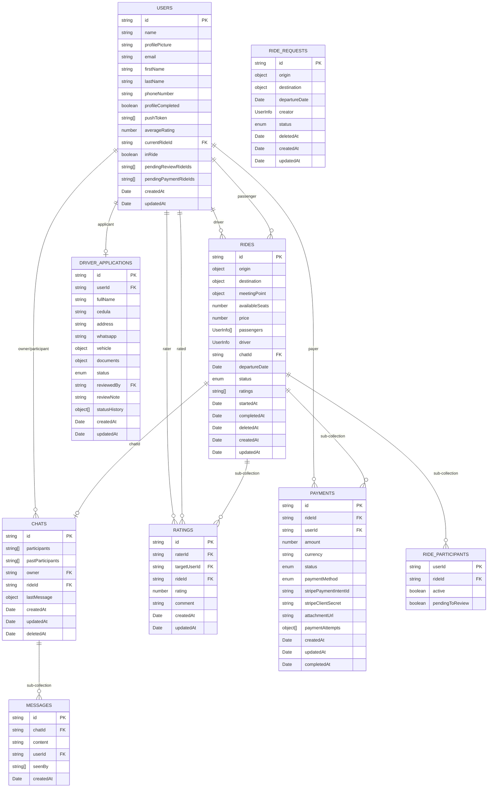

# Database Schema — Carpil API

The project uses **Firebase Firestore** (NoSQL document database) with a repository pattern that allows future migration to PostgreSQL or MongoDB.

---

## Diagram



---

## Collections

### `users`

Perfiles de todos los usuarios de la plataforma.

| Campo | Tipo | Descripción |
|-------|------|-------------|
| `id` | `string` | ID del documento (Firebase UID) |
| `name` | `string` | Nombre completo |
| `profilePicture` | `string` | URL de foto de perfil |
| `email` | `string?` | Correo electrónico |
| `firstName` | `string?` | Nombre |
| `lastName` | `string?` | Apellido |
| `phoneNumber` | `string?` | Teléfono (8 dígitos, Costa Rica) |
| `profileCompleted` | `boolean?` | Si completó su perfil |
| `pushToken` | `string[]?` | Tokens de notificaciones push |
| `averageRating` | `number?` | Promedio de calificaciones recibidas |
| `currentRideId` | `string?` | ID del viaje activo actual |
| `inRide` | `boolean?` | Si el usuario está en un viaje activo |
| `pendingReviewRideIds` | `string[]?` | Viajes pendientes de calificar |
| `pendingPaymentRideIds` | `string[]?` | Viajes con pago pendiente |
| `createdAt` | `Date?` | Fecha de creación |
| `updatedAt` | `Date?` | Última actualización |

---

### `rides`

Viajes publicados por conductores.

| Campo | Tipo | Descripción |
|-------|------|-------------|
| `id` | `string` | ID del documento |
| `origin` | `Location` | Punto de origen |
| `destination` | `Location` | Destino |
| `meetingPoint` | `Location?` | Punto de encuentro opcional |
| `availableSeats` | `number` | Asientos disponibles (1–4) |
| `price` | `number` | Precio por pasajero (1–10,000 CRC) |
| `passengers` | `UserInfo[]` | Lista de pasajeros del viaje |
| `driver` | `UserInfo` | Información del conductor |
| `chatId` | `string?` | ID del chat asociado |
| `departureDate` | `Date` | Fecha y hora de salida |
| `status` | `RideStatus` | Estado actual del viaje |
| `ratings` | `string[]?` | IDs de calificaciones del viaje |
| `startedAt` | `Date?` | Cuando inició el viaje |
| `completedAt` | `Date?` | Cuando se completó el viaje |
| `deletedAt` | `Date?` | Soft delete |
| `createdAt` | `Date` | Fecha de creación |
| `updatedAt` | `Date` | Última actualización |

**`RideStatus` (flujo de estados):**
```
active → in_progress → in_route → on_checkout → completed
```
- `active` — Publicado, esperando pasajeros
- `in_progress` — Tiene pasajeros, aún no salió
- `in_route` — En camino
- `on_checkout` — Procesando pagos y cierre
- `completed` — Finalizado

**Sub-colecciones:**

#### `rides/{rideId}/participants`

| Campo | Tipo | Descripción |
|-------|------|-------------|
| `userId` | `string` | ID del documento (= ID del usuario) |
| `active` | `boolean` | Si sigue activo en el viaje |
| `pendingToReview` | `boolean` | Si tiene calificación pendiente |

#### `rides/{rideId}/payments`

Ver sección [`payments`](#payments) más abajo.

#### `rides/{rideId}/ratings`

Ver sección [`ratings`](#ratings) más abajo.

---

### `ride-requests`

Solicitudes de pasajeros que buscan un viaje.

| Campo | Tipo | Descripción |
|-------|------|-------------|
| `id` | `string` | ID del documento |
| `origin` | `Location` | Origen deseado |
| `destination` | `Location` | Destino deseado |
| `departureDate` | `Date` | Fecha/hora requerida |
| `creator` | `UserInfo` | Usuario que creó la solicitud |
| `status` | `RideRequestStatus` | Estado de la solicitud |
| `deletedAt` | `Date?` | Soft delete |
| `createdAt` | `Date` | Fecha de creación |
| `updatedAt` | `Date` | Última actualización |

**`RideRequestStatus`:** `active` | `canceled` | `expired`

---

### `chats`

Chats grupales por viaje.

| Campo | Tipo | Descripción |
|-------|------|-------------|
| `id` | `string` | ID del documento |
| `participants` | `string[]` | IDs de usuarios activos en el chat |
| `pastParticipants` | `string[]?` | IDs de usuarios que salieron |
| `owner` | `string` | ID del usuario creador (siempre en `participants`) |
| `rideId` | `string?` | ID del viaje asociado |
| `lastMessage` | `Message?` | Último mensaje (para previews) |
| `createdAt` | `Date` | Fecha de creación |
| `updatedAt` | `Date` | Última actualización |
| `deletedAt` | `Date?` | Soft delete |

#### `chats/{chatId}/messages`

| Campo | Tipo | Descripción |
|-------|------|-------------|
| `id` | `string` | ID del documento |
| `content` | `string` | Contenido cifrado (1–1000 chars) |
| `userId` | `string` | ID del autor |
| `seenBy` | `string[]` | IDs de usuarios que lo leyeron |
| `createdAt` | `Date` | Fecha de envío |

---

### `ratings`

Calificaciones entre usuarios post-viaje. Se almacenan también como sub-colección en `rides/{rideId}/ratings`.

| Campo | Tipo | Descripción |
|-------|------|-------------|
| `id` | `string` | ID del documento |
| `raterId` | `string` | ID del usuario que califica |
| `targetUserId` | `string` | ID del usuario calificado |
| `rideId` | `string` | ID del viaje correspondiente |
| `rating` | `number` | Puntuación (1–5, entero) |
| `comment` | `string?` | Comentario (max 500 chars) |
| `createdAt` | `Date` | Fecha de creación |
| `updatedAt` | `Date` | Última actualización |

> **Nota:** Las calificaciones se guardan en dos lugares: colección raíz `ratings/` y sub-colección `rides/{rideId}/ratings/`.

---

### `payments`

Pagos por pasajero por viaje. Se almacenan como sub-colección en `rides/{rideId}/payments`.

| Campo | Tipo | Descripción |
|-------|------|-------------|
| `id` | `string` | ID del documento |
| `rideId` | `string` | ID del viaje |
| `userId` | `string` | ID del pasajero que paga |
| `amount` | `number` | Monto (> 0) |
| `currency` | `string` | Moneda (default: `crc`) |
| `status` | `PaymentStatus` | Estado del pago |
| `paymentMethod` | `PaymentMethod` | Método de pago |
| `stripePaymentIntentId` | `string?` | ID de Stripe (para tarjeta) |
| `stripeClientSecret` | `string?` | Client secret de Stripe |
| `attachmentUrl` | `string?` | Comprobante SINPE |
| `description` | `string?` | Descripción |
| `paymentAttempts` | `PaymentAttempt[]` | Historial de intentos |
| `createdAt` | `Date` | Fecha de creación |
| `updatedAt` | `Date` | Última actualización |
| `completedAt` | `Date?` | Fecha de pago exitoso |

**`PaymentStatus`:** `pending` → `processing` → `succeeded` / `failed` / `cancelled`

**`PaymentMethod`:** `unspecified` | `debit-card` | `sinpe`

**`PaymentAttempt`:**
```typescript
{
  method: 'debit-card' | 'sinpe'
  stripePaymentIntentId?: string
  attachmentUrl?: string
  status: string
  timestamp: Date
  errorMessage?: string
}
```

---

### `driver-applications`

Solicitudes de registro como conductor.

| Campo | Tipo | Descripción |
|-------|------|-------------|
| `id` | `string` | ID del documento |
| `userId` | `string` | ID del usuario solicitante (Firebase UID) |
| `fullName` | `string` | Nombre completo (1–200 chars) |
| `cedula` | `string` | Número de cédula (9–12 chars) |
| `address` | `string` | Dirección (1–500 chars) |
| `whatsapp` | `string` | Número de WhatsApp (8–20 chars) |
| `vehicle` | `DriverApplicationVehicle` | Información del vehículo |
| `documents` | `DriverApplicationDocument` | URLs de documentos requeridos |
| `status` | `DriverApplicationStatus` | Estado de la solicitud |
| `reviewedBy` | `string?` | ID del admin que revisó |
| `reviewNote` | `string?` | Nota de revisión (max 1000 chars) |
| `statusHistory` | `DriverApplicationStatusHistory[]` | Historial de cambios de estado |
| `createdAt` | `Date` | Fecha de creación |
| `updatedAt` | `Date` | Última actualización |

**`DriverApplicationStatus` (flujo de estados):**
```
pending → in_review → approved
                    → changes_requested → in_review
                    → rejected
```
- `pending` — Enviada, esperando revisión
- `in_review` — En proceso de revisión
- `changes_requested` — Se solicitaron correcciones al conductor
- `approved` — Aprobada
- `rejected` — Rechazada

**`DriverApplicationVehicle`:**

| Campo | Tipo | Descripción |
|-------|------|-------------|
| `brand` | `string` | Marca del vehículo (1–100 chars) |
| `model` | `string` | Modelo (1–100 chars) |
| `year` | `number` | Año (1990 – año actual + 1) |
| `color` | `string` | Color (1–50 chars) |
| `plate` | `string` | Placa (1–20 chars) |
| `availableSeats` | `number` | Asientos disponibles (1–4) |

**`DriverApplicationDocument`:**

| Campo | Tipo | Descripción |
|-------|------|-------------|
| `cedulaFront` | `string` | URL — frente de la cédula |
| `cedulaBack` | `string` | URL — reverso de la cédula |
| `vehicleRegistration` | `string` | URL — marchamo / registro del vehículo |
| `criminalRecord` | `string?` | URL — hoja de delincuencia (opcional) |
| `selfie` | `string?` | URL — selfie de verificación de identidad (opcional) |

**`DriverApplicationStatusHistory`:**

| Campo | Tipo | Descripción |
|-------|------|-------------|
| `status` | `DriverApplicationStatus` | Estado al momento del cambio |
| `changedAt` | `Date` | Fecha del cambio |
| `changedBy` | `string` | ID del usuario que realizó el cambio |
| `note` | `string?` | Nota adicional |

---

## Shared Types

### `Location`

Usado en `rides` y `ride-requests` para origen, destino y punto de encuentro.

```typescript
{
  id: string
  name: {
    primary: string    // Nombre principal (max 250 chars)
    secondary: string  // Detalle adicional (max 250 chars)
  }
  location: {
    lat: number        // -90 a 90
    lng: number        // -180 a 180
  }
}
```

### `UserInfo`

Snapshot del usuario embebido en `rides` y `ride-requests`.

```typescript
{
  id: string
  name: string
  profilePicture: string
  role?: 'driver' | 'passenger'
}
```

---

## Relationships

| Relación | Tipo | Referencia |
|----------|------|------------|
| User → Ride (conductor) | 1:N | `rides.driver.id` |
| User → Ride (pasajero) | N:M | `rides.passengers[].id` |
| Ride → Chat | 1:1 | `rides.chatId` / `chats.rideId` |
| User → Chat | N:M | `chats.participants[]` |
| Chat → Messages | 1:N | sub-colección `chats/{id}/messages` |
| Ride → Payments | 1:N | sub-colección `rides/{id}/payments` |
| Ride → Ratings | 1:N | sub-colección `rides/{id}/ratings` |
| Ride → Participants | 1:N | sub-colección `rides/{id}/participants` |
| User → Ratings (dado) | 1:N | `ratings.raterId` |
| User → Ratings (recibido) | 1:N | `ratings.targetUserId` |
| User → DriverApplication | 1:1 | `driver-applications.userId` |

---

## Key Constraints

- **Asientos:** 1–4 por viaje
- **Precio:** 1–10,000 CRC
- **Calificación:** Entero de 1 a 5, una por usuario por viaje, solo en viajes completados
- **Teléfono:** 8 dígitos numéricos (formato Costa Rica)
- **Mensajes:** Cifrados en reposo, 1–1000 caracteres
- **Soft delete:** `rides`, `chats`, `ride-requests` usan `deletedAt` en lugar de borrado físico
- **Ubicaciones:** Origin, destination y meetingPoint deben ser distintos entre sí
- **Driver application:** Un usuario puede tener como máximo una solicitud activa (no rechazada)

---

## File Locations

```
src/
├── models/          # Interfaces TypeScript
├── schemas/         # Validaciones Zod
└── repositories/
    └── firebase/    # Implementaciones Firestore
```
